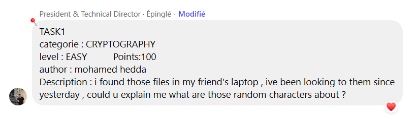
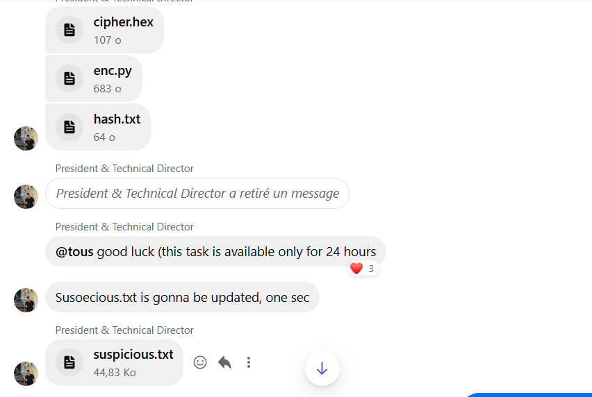
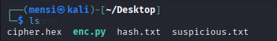
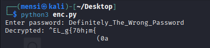
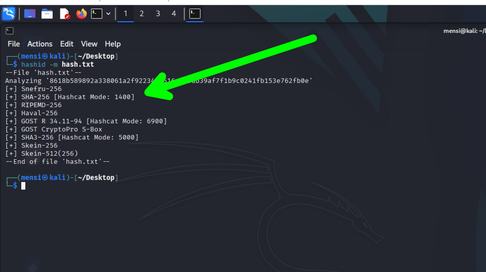
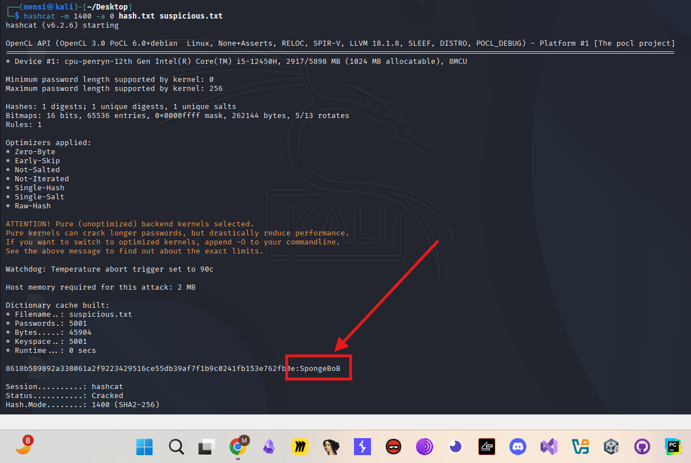
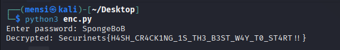

# TASK1 - Writeup

## Description





## Solution

This task is a pretty straighforward hash cracking task ,, we are provided with 4 files.



the main file is enc.py which ask for a password and then does some decryption



also we have `hash.txt` and `suspicious.txt` which is a wordlist ,, so besically all we have to do is crack the password using `hashcat` and `hashid` and get our flag .

first thing i will identity the hash function algorithm using `hashid`



and as we can see the hash function algorithm is SHA256 ,, all we have to do now is use `hashcat` to crack the hash and get the password .



and this way we got our password `SpongeBoB`


now we will send our password `SpongeBoB` to `enc.py` input to get our flag



## Flag

```
Securinets{H4SH_CR4CK1NG_1S_TH3_B3ST_W4Y_T0_ST4RT!!}
```
