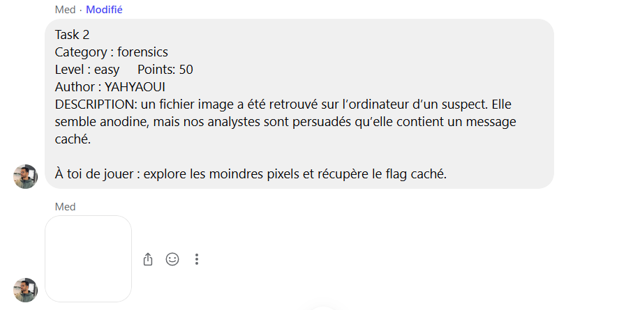
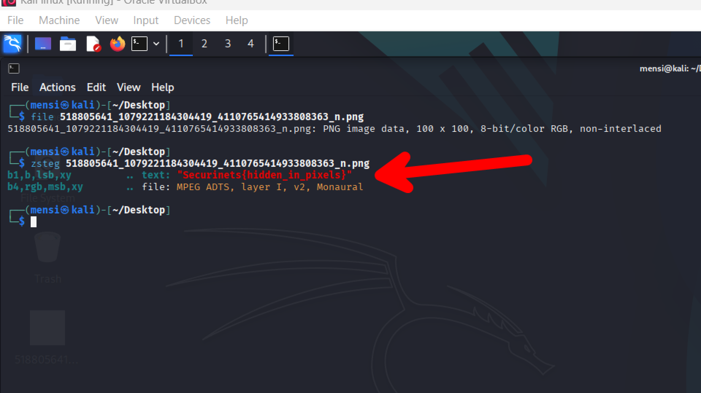

# TASK2 - Writeup

## Description



## Solution

This task is pretty straightforward ,, the author used LSB Encoding to hide the flag data inside the provided image

```
LSB (Least Significant Bit) Encoding
This is one of the most common techniques for hiding data in images. It involves modifying the least significant bit of each pixel’s color channel to encode the secret message or flag. zsteg can detect this if the message is embedded in the LSB of the red, green, or blue channels.
```

so basically all we have to do is use `zsteg` to recover the flag



## Flag

```
Securinets{hidden_in_pixels}
```
