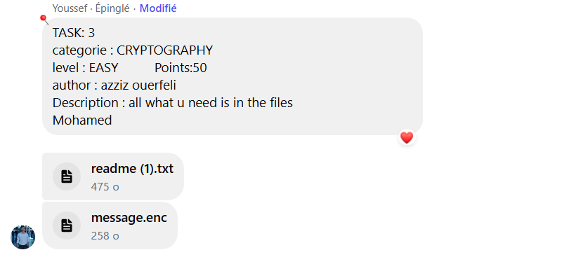
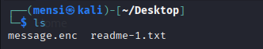
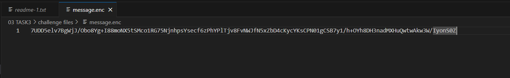
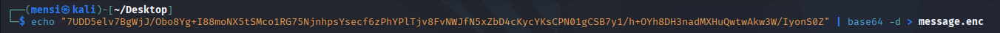
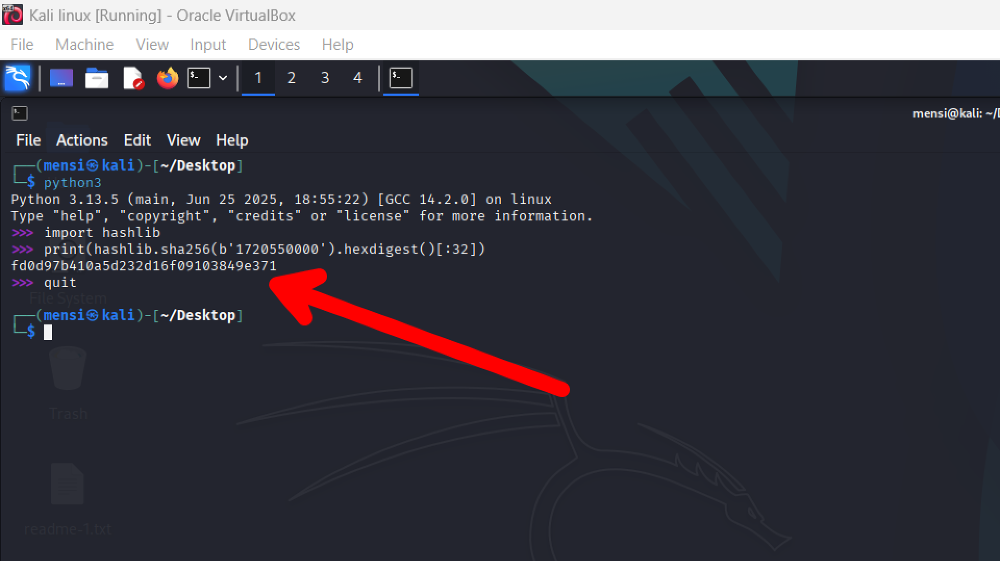
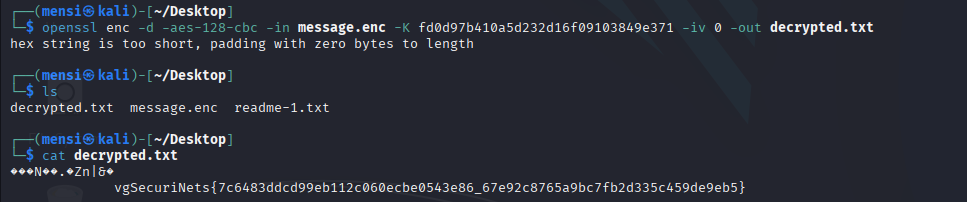
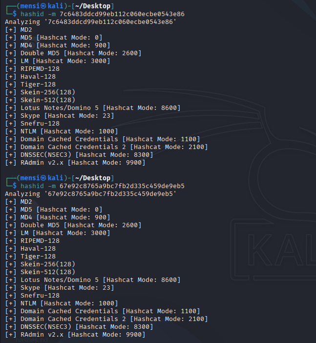
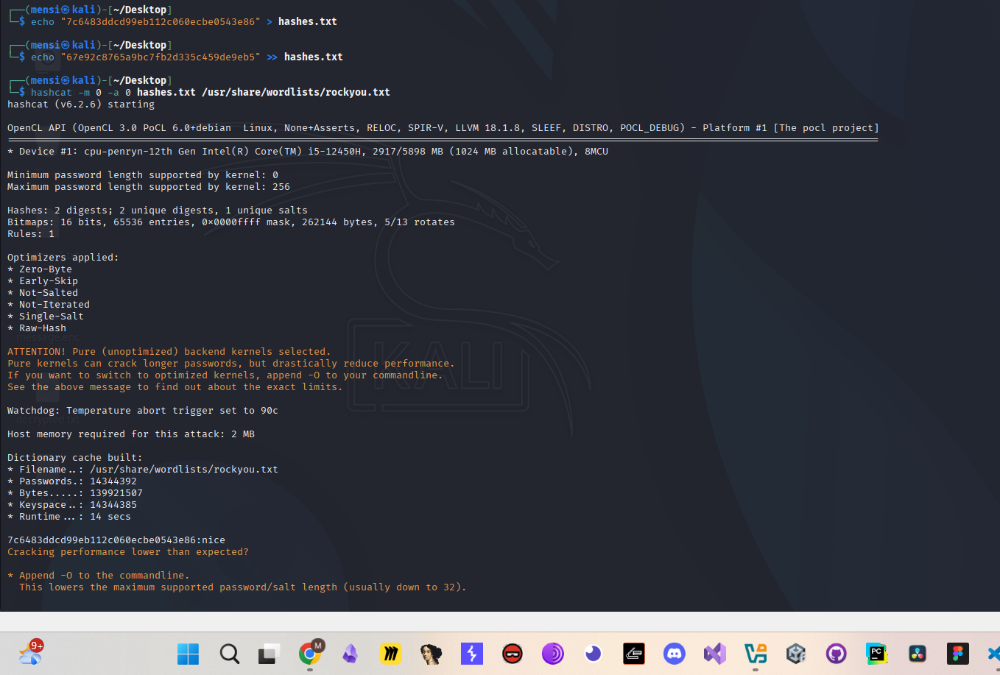
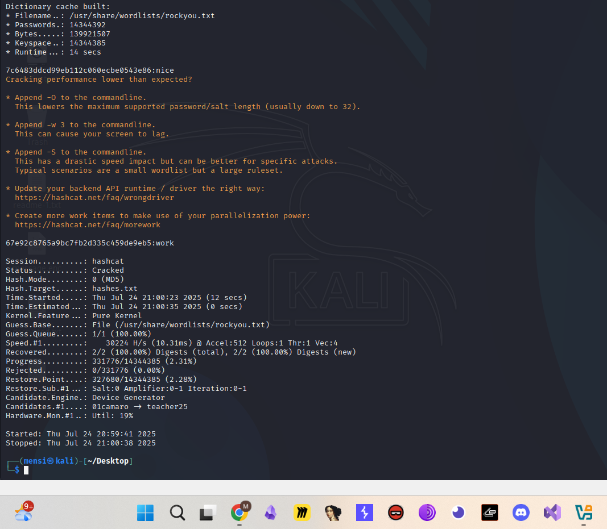

# TASK3 - Writeup

## Description



## Solution

in this task we are provided with 2 files






the main idea of the challenges is we should find the decryption key and recover the flag.

first step we will decode message.enc with `base64` tool



now we will use the timestamp to get the decryption key



And we got it


and after building the key now we should use `openssl` to get the decryption.txt



Now we can see that our flag has two parts ,, each part is a hash ,, we will try to crack both hashes using `rockyou.txt` wordlist .



we can see that both hashes are MD5 ,, we will use `hashcat` tool to crack both.





and we are done ,, the cracked hashes are `nice` and `work` ,, our flag is `Securinets{nice_work}`

## Flag

```
Securinets{nice_work}
```
