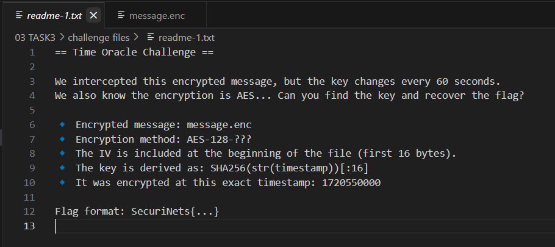

# TASK3 - Writeup

## Description

## Solution

in this task we are provided with 2 files

the main idea of the challenges is we should find the decryption key and recover the flag.

first step we will decode message.enc with `base64` tool

now we will use the timestamp to get the decryption key

