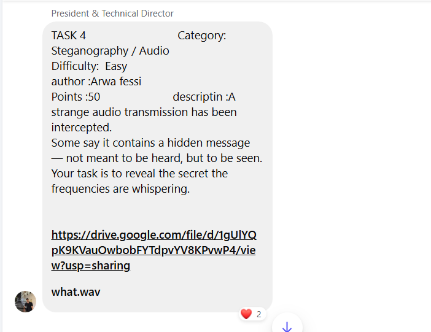
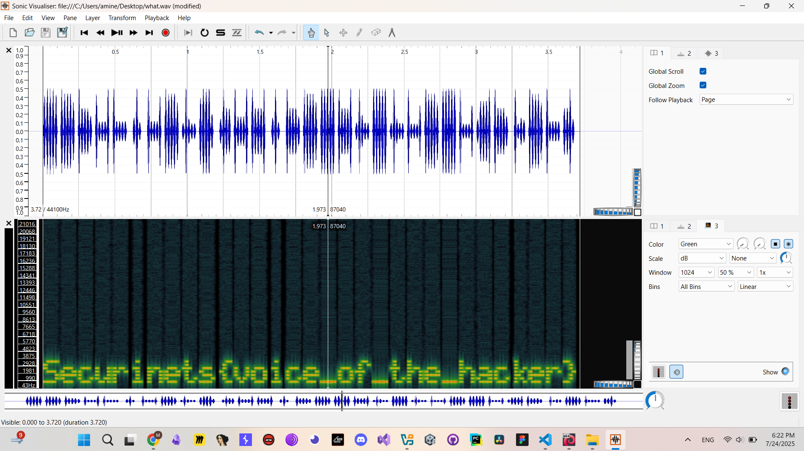

# TASK4 - Writeup

## Description



## Solution

In this task we are given a `what.wav` ,, the first thing that came to my mind when solving this challenge is to analysis the frequencies of this `what.wav` file and view the spectrogram using `Sonic Visualizer`.



And we done ,, we got our flag

## Flag

```
Securinets{voice_of_the_hacker}
```
