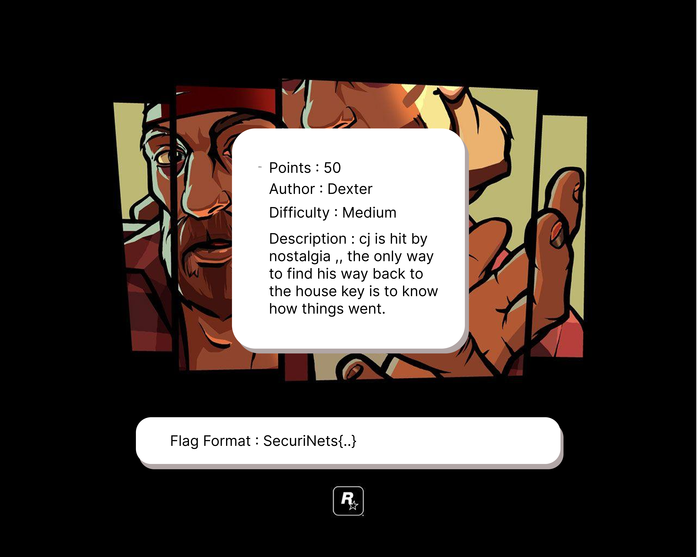
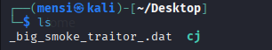
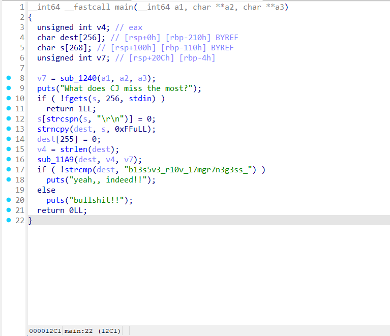
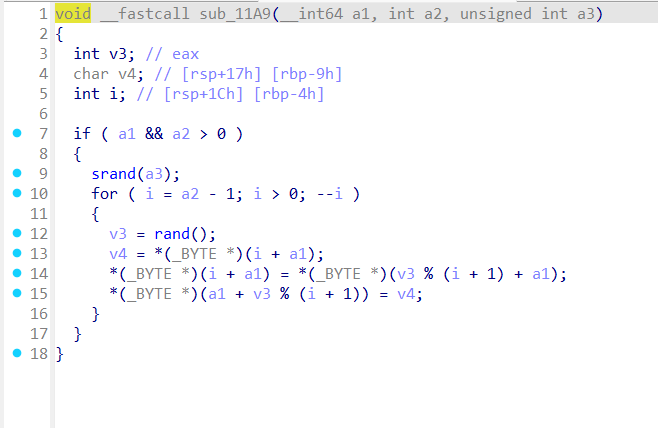
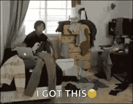
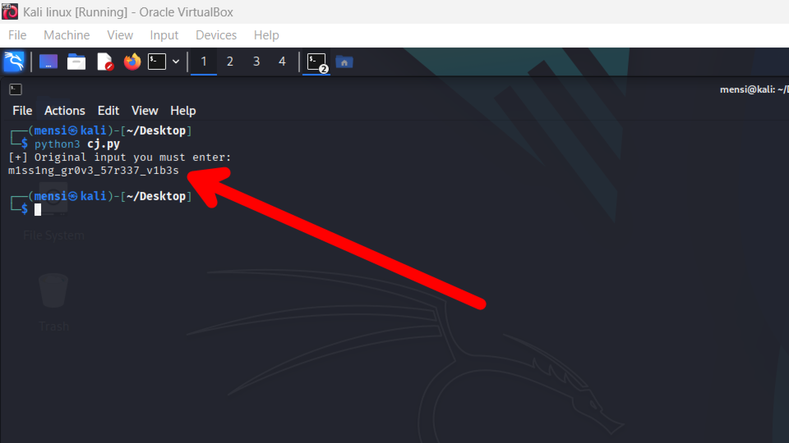
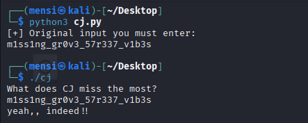

# TASK5 - Writeup

## Description



## Solution

for this task we have a binary and an encrypted file



the binary takes an input from the user and then make a shuffle using `Fisher-Yates Algorithm` and compare the shuffled input against this string `b13s5v3_r10v_17mgr7n3g3ss_` ,,





so basically to solve this task we have to start from `b13s5v3_r10v_17mgr7n3g3ss_` and reverse the shuffle to get what we should input to successfully pass the comparison and solve this mess.



for that i made a python3 script to do the job using CDLL to sync with the program and predict the randomness used to shuffle our input in `Fisher-Yates Algorithm`.

```python
from ctypes import CDLL, c_int
import ctypes

# Load libc
libc = CDLL("libc.so.6")
srand = libc.srand
rand = libc.rand
srand.argtypes = [c_int]
rand.restype = c_int

# Parameters
TARGET = b"b13s5v3_r10v_17mgr7n3g3ss_"
SEED_STRING = "Ryder"

# Compute seed like in the C binary
def compute_seed(key: str) -> int:
    value = 0
    for c in key:
        value = 31 * value + ord(c)
    return value

# Generate swap indices using the same libc rand()
def generate_swaps(length: int, seed: int):
    srand(seed)
    swaps = []
    for i in range(length - 1, 0, -1):
        j = rand() % (i + 1)
        swaps.append((i, j))
    return swaps

# Reverse the swaps
def reverse_shuffle(shuffled: bytes, swaps: list) -> str:
    data = list(shuffled)
    for i, j in reversed(swaps):
        data[i], data[j] = data[j], data[i]
    return ''.join(map(chr, data))

if __name__ == "__main__":
    seed = compute_seed(SEED_STRING)
    swaps = generate_swaps(len(TARGET), seed)
    original = reverse_shuffle(TARGET, swaps)

    print("[+] Original input you must enter:")
    print(original)

```

running this script will give us the correct input .



which is confirmed by the binary



Now we will use
