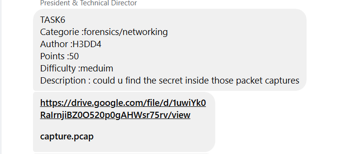
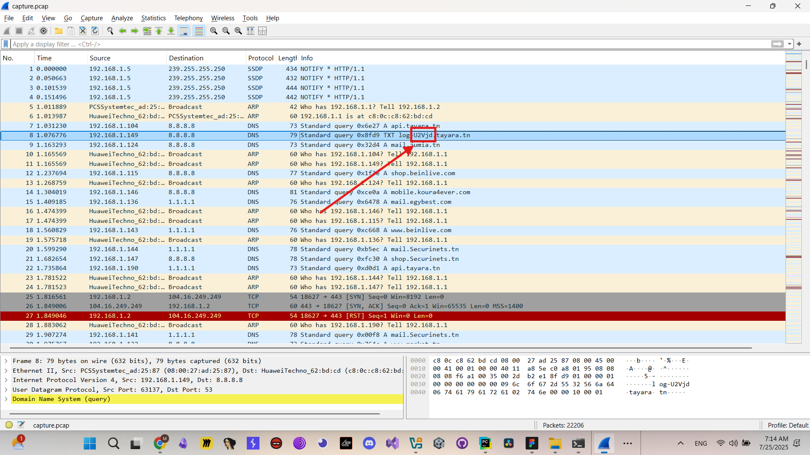
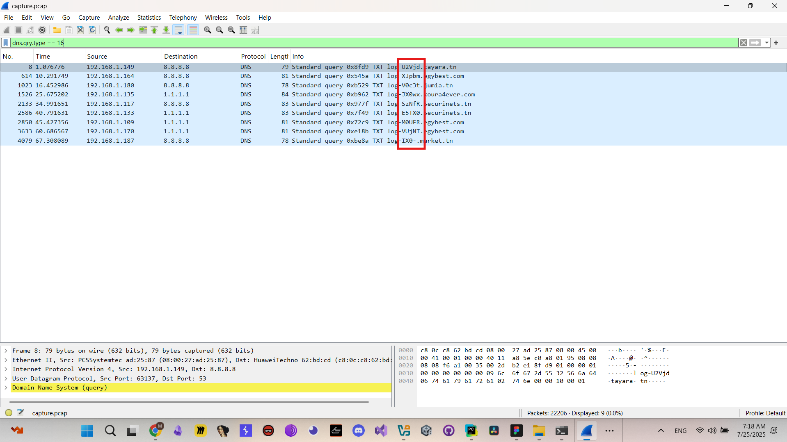
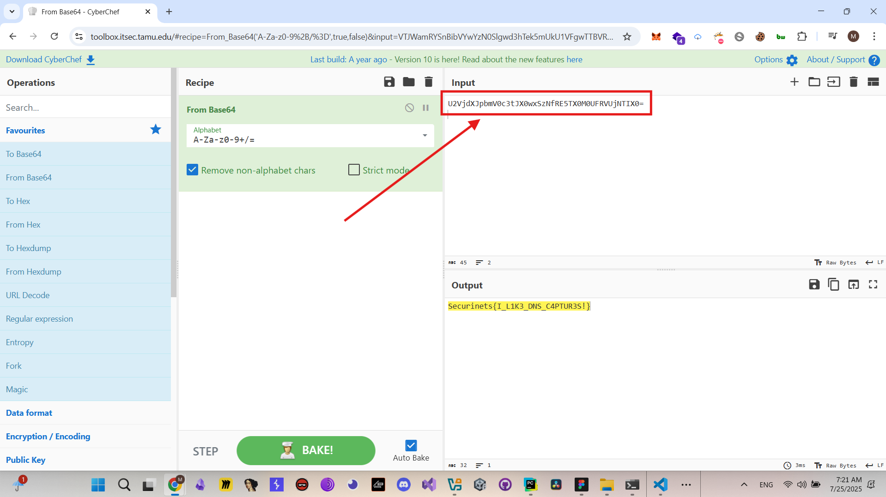

# TASK6 - Writeup

## Description



## Solution

Is this task we are provided with `capture.pcap` file ,, so basically all we have to do is analyze the pcap file to get our flag.
the first thing we noticed when we opened `capture.pcap` file in `wireshark` is a bas64 chunk in DNS query



so i applied a filter `dns.qry.type == 16` to extract all the dns queries and i noticed many chunks in the extracted packets



after extracting all the base64 chunks we got a base64 string ,, and after decoding it in `cyberchef` we got our flag.



## Flag

```
Securinets{I_L1K3_DNS_C4PTUR3S!}
```
