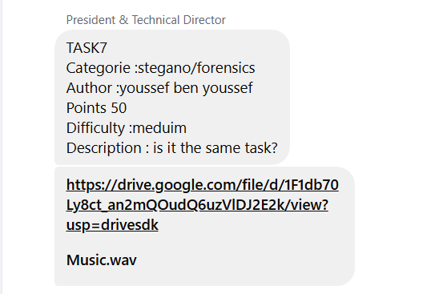
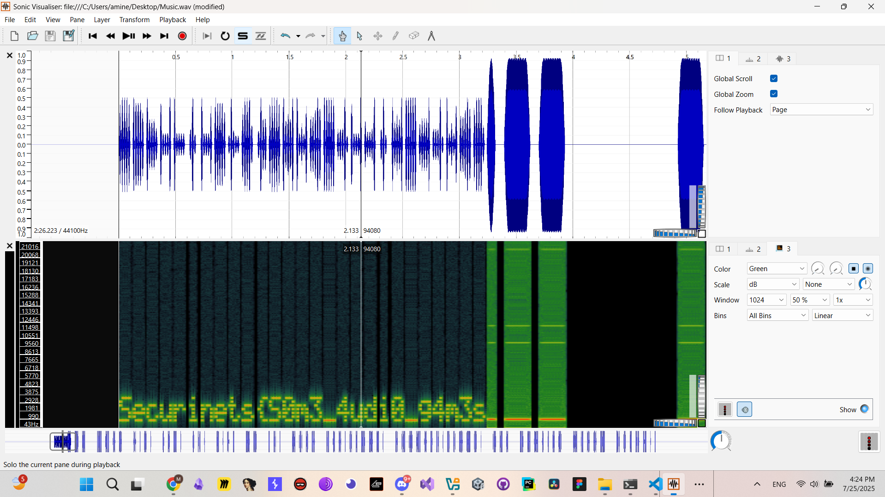
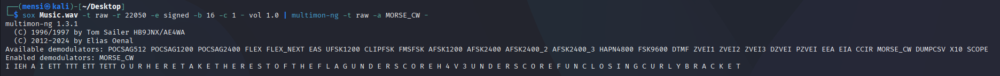
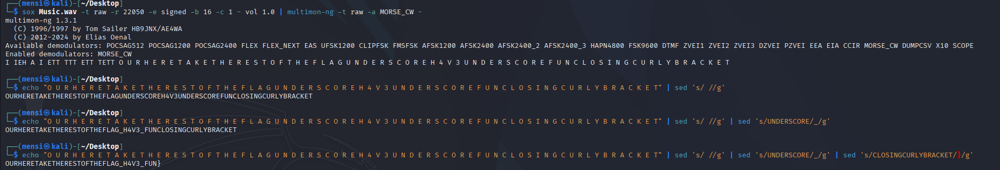

# TASK7 - Writeup

## Description



## Solution

For this task we are provided with `Music.wav` file ,, the first thing i did is analyzing the the file in `Sonic Visualizer`
and we got our first half of the flag `Securinets{S0m3_4udi0_g4m3s`



while looking for the other half of i discovered a hidden morse code inside the file ,, so i combined `sox` and `multimon-ng` to decode the data and i successfully got a readable characters.



After some cleaning we got the other half `_H4V3_FUN}`



## Flag

```
Securinets{S0m3_4udi0_g4m3s_H4V3_FUN}
```
