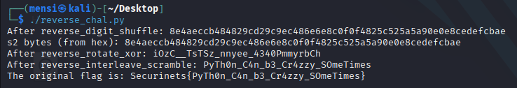

# TASK8 - Writeup

## Description


## Solution

For this task we are given a `chal.pyc` file ,, and as usual the first thing that came to my mind is [https://pylingual.io/](https://pylingual.io/) ,, i used PyLingual Python Decompiler online website to decompile the `chal.pyc` file


and we got the following script.

```python
# Decompiled with PyLingual (https://pylingual.io)
# Internal filename: chal.py
# Bytecode version: 3.12.0rc2 (3531)
# Source timestamp: 2025-07-20 21:37:08 UTC (1753047428)

import sys

def interleave_scramble(s: str, rounds: int) -> str:
    for _ in range(rounds):
        mid = len(s) // 2
        a, b = (s[:mid][::-1], s[mid:][::-1])
        s = ''.join((x + y for x, y in zip(a, b)))
    return s

def rotate_xor(data: bytes, rot: int, key: int) -> bytes:
    out = bytearray()
    for b in data:
        r = b << rot & 255 | b >> 8 - rot
        out.append(r ^ key)
    return bytes(out)

def digit_shuffle(s: str, seed: int) -> str:
    digits = list(s)
    for i in range(len(digits)):
        j = i * seed % len(digits)
        digits[i], digits[j] = (digits[j], digits[i])
    return ''.join(digits)

def check_flag(candidate: str) -> bool:
    if not candidate.startswith('Securinets{') or not candidate.endswith('}'):
        return False
    core = candidate[len('Securinets{'):-1]
    s1 = interleave_scramble(core, rounds=3)
    s2 = rotate_xor(s1.encode(), rot=5, key=163)
    final = digit_shuffle(s2.hex(), seed=7)
    target = '85682cce0a4d29cdeec9ee0c0e4ce80545a82fcf2eeec9456b8b88afac49'
    return final == target
if __name__ == '__main__':
    flag = input('Enter flag: ').strip()
    print(f'🎉 Congratulations! 🎉\nYou’ve cracked the code and unveiled the hidden treasure:{flag}!' if check_flag(flag) else 'Wrong!')
```

the script takes our input pass it through many layers of obfuscation and jumble and then compare it against a target string ,, it the our input is the original flag it should match the target string after the obfuscation ,, so in order to solve this challenge we should reverse the script logic to get our flag.

for that i made the following script that build the original flag.

```python
def reverse_digit_shuffle(s: str, seed: int) -> str:
    digits = list(s)
    n = len(digits)

    # We need to reverse the swaps in the opposite order of the original shuffle.
    # The original loop was from i = 0 to n-1.
    # So we reverse from i = n-1 down to 0.
    for i in range(n - 1, -1, -1):
        j = i * seed % n
        digits[i], digits[j] = (digits[j], digits[i]) # Swap back
    return ''.join(digits)

def reverse_rotate_xor(data: bytes, rot: int, key: int) -> bytes:
    out = bytearray()
    for b in data:
        # Step 1: Reverse XOR
        xor_reversed_byte = b ^ key

        # Step 2: Reverse Rotation
        # If the original operation was a left rotation: (x << rot) | (x >> (8 - rot))
        # The reverse operation is a right rotation: (x >> rot) | (x << (8 - rot))
        original_byte = (xor_reversed_byte >> rot) | (xor_reversed_byte << (8 - rot)) & 255
        out.append(original_byte)
    return bytes(out)

def reverse_interleave_scramble(s: str, rounds: int) -> str:
    for _ in range(rounds):
        n = len(s)

        # We know s was formed by:
        # a = original_first_half_reversed
        # b = original_second_half_reversed
        # s = ''.join((x + y for x, y in zip(a, b)))

        # Extract 'a' and 'b' parts from 's'
        # 'a' contains characters at even indices
        # 'b' contains characters at odd indices

        a_parts = s[::2]
        b_parts = s[1::2]

        # Since a = s[:mid][::-1] and b = s[mid:][::-1] in the forward pass
        # To get the original s[:mid] we need to reverse a_parts
        # To get the original s[mid:] we need to reverse b_parts

        original_first_half = a_parts[::-1]
        original_second_half = b_parts[::-1]

        s = original_first_half + original_second_half
    return s

def get_original_flag():
    target = '85682cce0a4d29cdeec9ee0c0e4ce80545a82fcf2eeec9456b8b88afac49'

    # Reverse digit_shuffle (final operation)
    s2_hex = reverse_digit_shuffle(target, seed=7)
    print(f"After reverse_digit_shuffle: {s2_hex}")

    # Reverse rotate_xor (s2_hex was the hex representation of s2)
    s2 = bytes.fromhex(s2_hex)
    print(f"s2 bytes (from hex): {s2.hex()}")

    s1_bytes = reverse_rotate_xor(s2, rot=5, key=163)
    # The original s1 was encoded to bytes, typically utf-8 or latin-1 for single bytes.
    # Given the values, latin-1 (or iso-8859-1) is often a safe bet for single byte encoding.
    s1 = s1_bytes.decode('latin-1')
    print(f"After reverse_rotate_xor: {s1}")

    # Reverse interleave_scramble (first operation on core)
    core = reverse_interleave_scramble(s1, rounds=3)
    print(f"After reverse_interleave_scramble: {core}")

    flag = f'Securinets{{{core}}}'
    return flag

if __name__ == '__main__':
    original_flag = get_original_flag()
    print(f'The original flag is: {original_flag}')
```

and after running this script we will got our flag.



## Flag

```
Securinets{PyTh0n_C4n_b3_Cr4zzy_SOmeTimes}
```
